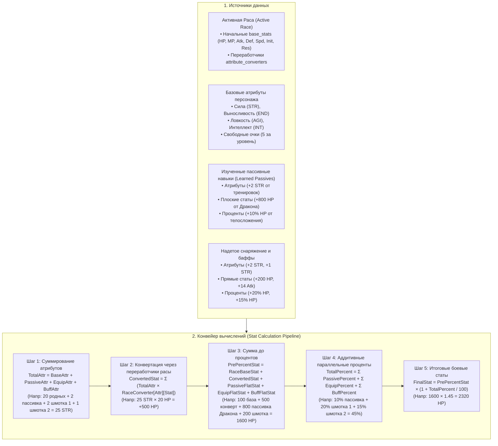

# Система характеристик, расовых скейлов, эволюции и экипировки (Character Stats System)

Данный документ описывает RPG-систему характеристик персонажей, начальных параметров рас, базовых атрибутов тела, расовых переработчиков (конвертеров), механику активной расы и эволюции, а также 5-шаговый конвейер вычисления боевых параметров от пассивных навыков и снаряжения.

---

## 1. Архитектура и ключевые правила

---

## 2. Начальные параметры расы (`base_stats`)

У каждой расы на 1-м уровне задаются базовые боевые параметры. Они представляют естественные физические и магические кондиции существа до любых тренировок:

| Раса | HP | MP | Физ. Атака | Физ. Защита | Маг. Атака | Маг. Защита | Скорость | Инициатива | Особенности и Резисты |
| :--- | :---: | :---: | :---: | :---: | :---: | :---: | :---: | :---: | :--- |
| **Человек** (`human`) | 100 | 30 | 10 | 6 | 6 | 6 | 3 | 5 | Сбалансированные параметры |
| **Эльф** (`elf`) | 70 | 60 | 8 | 4 | 12 | 10 | 4 | 8 | Высокая магия и скорость, Природа +10% |
| **Скелет** (`skeleton`) | 120 | 10 | 12 | 8 | 4 | 4 | 2 | 4 | Яд +100%, Тьма +50%, Свет -50%, Огонь -20% |
| **Старший лич** (`elder-lich`) | 220 | 200 | 14 | 12 | 32 | 28 | 3 | 7 | Высшая магия, Тьма +70%, Холод +40% |
| **Драконид** (`dragonoid`) | 350 | 80 | 24 | 18 | 16 | 14 | 3 | 6 | Огонь +50%, Физ. защита +15% |

> [!NOTE]
> Все 114 рас в `races.json` поддерживаются автоматически: если у расы не заданы индивидуальные числа, движок применяет умные фолбэки на основе категории (`humanoid`, `demi-human`, `heteromorphic`) и ступени (`basic`, `advanced`, `rare`).

---

## 3. Базовые характеристики персонажа (Core Attributes)

У самого персонажа есть 4 ключевых характеристики тела:
* **Сила (`strength` / `STR`)**: физическая мощь, грузоподъемность, тяжелые удары.
* **Выносливость (`endurance` / `END`)**: запас жизненных сил, крепость тела, естественная броня и сопротивляемость.
* **Ловкость (`agility` / `AGI`)**: реакция, точность, подвижность, опережение в очереди ходов.
* **Интеллект (`intelligence` / `INT`)**: объем маны, сила заклинаний, ментальная защита.

**Правила начисления:**
1. Изначально у персонажа все 4 атрибута равны **0**.
2. За каждый полученный уровень персонажу начисляются **5 свободных очков характеристик** (`free_attribute_points`).
3. Игрок может свободно распределять их в меню персонажа через `investAttribute` / `refundAttribute`.
4. Для процедурных мобов атрибуты распределяются автоматически в зависимости от архетипа (`warrior`, `tank`, `archer`, `mage`, `assassin`, `balanced`).

---

## 4. Характеристические переработчики расы (`attribute_converters`)

Каждая раса обладает уникальными переработчиками — коэффициентами того, во что превращается 1 очко атрибута в её теле:

* **У Человека**:
  * 1 очко Силы $\to$ **+20 HP**, **+10 физ. атаки**, **+8 физ. защиты**
  * 1 очко Выносливости $\to$ **+35 HP**, **+10 физ. защиты**, **+1% физ. сопротивления**
  * 1 очко Ловкости $\to$ **+0.1 скорости**, **+2 инициативы**, **+4 физ. атаки**
  * 1 очко Интеллекта $\to$ **+20 MP**, **+10 маг. атаки**, **+8 маг. защиты**
* **У Эльфа**:
  * 1 очко Силы $\to$ **+15 HP**, **+8 физ. атаки**, **+7 физ. защиты**
  * 1 очко Выносливости $\to$ **+25 HP**, **+8 физ. защиты**
  * 1 очко Ловкости $\to$ **+0.15 скорости**, **+3 инициативы**, **+6 физ. атаки**
  * 1 очко Интеллекта $\to$ **+30 MP**, **+15 маг. атаки**, **+10 маг. защиты**
* **У Скелета**:
  * 1 очко Силы $\to$ **+25 HP**, **+12 физ. атаки**, **+10 физ. защиты**
  * 1 очко Выносливости $\to$ **+40 HP**, **+14 физ. защиты**, **+2% физ. сопротивления**

---

## 5. Активная раса и эволюция (`active_race`)

Персонаж может развивать ветки нескольких рас (например, скелет-маг $\to$ лич $\to$ оверлорд), но **активной расой тела в каждый момент времени является только одна**:

* При смене активной расы (или эволюции):
  1. **Базовые параметры (`base_stats`)** и **коэффициенты скейлинга (`attribute_converters`)** мгновенно заменяются на параметры новой расы.
  2. **Все изученные навыки и способности (включая пассивные навыки прошлых рас) навсегда остаются в книге умений персонажа!**

### Канонический пример: «Дракон $\to$ Лич»
1. Персонаж был Драконом и изучил пассивку *«Колоссальное телосложение»* ($+800$ плоских HP, $+10\%$ HP, $+2$ STR).
2. Персонаж эволюционирует в Лича (`active_race = 'elder-lich'`).
3. Базовые статы становятся личевскими (220 HP, 32 маг. атаки).
4. $+2$ STR от пассивки Дракона суммируются с родной силой и скейлятся уже по коэффициентам Лича ($2 \times 18 = +36$ HP).
5. $+800$ HP от пассивки Дракона прибавляются к сумме до процентов.
6. $+10\%$ HP от пассивки Дракона параллельно увеличивают итоговое здоровье Лича!

---

## 6. Конвейер расчёта экипировки и модификаторов (5-Step Pipeline)

Предметы экипировки и пассивки могут давать модификаторы трёх типов:
1. **Плоские атрибуты**: `+2 strength`, `+1 endurance`.
2. **Плоские боевые статы**: `+200 hp`, `+14 attack`.
3. **Процентные бонусы**: `+20% hp`, `+15% hp` (или `hp: "20%"`).

### Шаги вычислений:

$$\text{Шаг 1 (Total Attributes):} \quad \text{TotalAttr}[A] = \text{BaseAttr}[A] + \sum \text{PassiveAttr}[A] + \sum \text{EquipAttr}[A] + \sum \text{BuffAttr}[A]$$

$$\text{Шаг 2 (Converted Stats):} \quad \text{ConvertedStat}[S] = \sum_A (\text{TotalAttr}[A] \times \text{RaceConverter}[A][S])$$

$$\text{Шаг 3 (Pre-percentage Stat):} \quad \text{PrePercent}[S] = \text{RaceBase}[S] + \text{ConvertedStat}[S] + \sum \text{PassiveFlat}[S] + \sum \text{EquipFlat}[S] + \sum \text{BuffFlat}[S]$$

$$\text{Шаг 4 (Parallel Additive Percentages):} \quad \text{TotalPercent}[S] = \sum \text{PassivePercent}[S] + \sum \text{EquipPercent}[S] + \sum \text{BuffPercent}[S]$$

$$\text{Шаг 5 (Final Stat):} \quad \text{FinalStat}[S] = \text{PrePercent}[S] \times \left(1 + \frac{\text{TotalPercent}[S]}{100}\right)$$

### Численный пример:
* Раса: Человек (базовое HP = 100, конвертер Силы = 20 HP/STR).
* Родные вложенные очки: 20 Силы.
* Вещь 1: $+2$ Силы, $+200$ HP, $+20\%$ HP.
* Вещь 2: $+1$ Сила, $+15\%$ HP.

1. **Шаг 1**: Итоговая Сила = $20 + 2 + 1 = \mathbf{23}$ STR.
2. **Шаг 2**: Прирост HP от Силы = $23 \times 20 = \mathbf{+460}$ HP.
3. **Шаг 3**: Сумма до процентов = $100 \text{ (база)} + 460 \text{ (конверт)} + 200 \text{ (вещь 1)} = \mathbf{760}$ HP.
4. **Шаг 4**: Аддитивные проценты = $20\% + 15\% = \mathbf{35\%}$.
5. **Шаг 5**: Итоговое здоровье = $760 \times (1 + 0.35) = \mathbf{1026}$ HP.

---

## 7. Программный интерфейс (API Reference)

### `src/renderer/utils/stats/characterStats.js`
* `calculateCharacterStats({ character, activeRaceId, racesData, equipmentItems, buffs, learnedSkills, level })` — выполняет полный 5-шаговый расчёт с возвратом разбивки `breakdown` и итоговых `stats`.
* `getRaceStatsConfig(raceOrId, racesData)` — возвращает конфигурацию расы (`base_stats` и `attribute_converters`) с гарантированными фолбэками.
* `parseStatsModifier(source)` — универсальный парсер атрибутов, плоских статов и процентов для предметов, пассивок и баффов.
* `distributeMobAttributes({ level, archetype, pointsPerLevel })` — процедурное распределение очков мобов.

### `src/renderer/composables/useCharacterStats.js`
* `investAttribute(characterId, attributeName, amount)` — вложение свободных очков в характеристику.
* `refundAttribute(characterId, attributeName, amount)` — возврат очков.
* `resetAttributes(characterId)` — полный сброс характеристик.
* `setActiveRace(characterId, raceId)` — переключение активной расы без потери способностей.
* `getCalculatedStats(characterId, options)` — расчёт статов в реактивном контексте.

---

## 8. Стандартизация ключей JSON (Short Keys & Aliases)

Для оптимизации размера JSON-файлов и читаемости в коде принят канонический формат:

| Канонический ключ | Описание | Поддерживаемые устаревшие алиасы |
| :--- | :--- | :--- |
| `skill_points` | Текущие очки навыков персонажа / ветки | `sp` |
| `spell_points` | Текущие очки спелов персонажа / ветки | `mp` (не путать с маной!) |
| `skill_points_per_level` | Очков навыков (SP) за уровень сущности | `sp_lvl` |
| `spell_points_per_level` | Очков спелов за уровень сущности | `mp_lvl` |
| `str` | Сила | `strength` |
| `end` | Выносливость | `endurance` |
| `agi` | Ловкость | `agility` |
| `int` | Интеллект | `intelligence` |
| `hp` | Здоровье | `health`, `hpmax` |
| `mp` | Мана (запас магической энергии) | `mana`, `mpmax` |
| `atk_phys` | Физическая атака | `phys_attack`, `attack` |
| `def_phys` | Физическая защита | `phys_defense`, `defense` |
| `atk_mag` | Магическая атака | `mag_attack` |
| `def_mag` | Магическая защита | `mag_defense` |
| `spd` | Скорость перемещения | `speed` |
| `init` | Инициатива | `initiative` |
| `crit_chance` | Шанс критического удара (%) | `crit_rate`, `crit`, `critical_chance` |
| `crit_dmg` | Сила критического удара (%) | `crit_damage`, `critical_damage`, `crit_mult` |
| `res` | Словарь сопротивлений | `resistances` |

### 8.1. Канонические ключи сопротивлений (`res` / `resistances`)

В системе характеристик, скейлов (`attribute_converters`) и табличном редакторе (`DataTableEditor`) приняты 8 канонических типов сопротивлений:

| Ключ | Название | Иконка | Описание |
| :--- | :--- | :---: | :--- |
| `physical` | Физический урон | 🛡️ | Защита от дробящего, колющего и рубящего оружия |
| `water` | Вода | 🌊 | Защита от гидроударов, водных потоков и урона стихии воды |
| `fire` | Огонь | 🔥 | Защита от пламени, горения и лавы |
| `cold` | Холод | ❄️ | Защита от обморожения и магии льда |
| `lightning` | Молния | ⚡ | Защита от электричества и шоковых атак |
| `poison` | Яд | 🧪 | Защита от токсинов, ядов и кислот (у нежити +100%) |
| `holy` | Свет | ☀️ | Защита от святой магии (у нежити слабость, отрицательное значение) |
| `dark` | Тьма | 🌑 | Защита от некромантии и теневых атак |

> [!IMPORTANT]
> 1. **Критический урон и шанс**: `crit_chance` (базовый шанс, например 5%) и `crit_dmg` (базовый критический урон, например 50%) полноценно участвуют в скейлинге от атрибутов (например, Ловкость $\to$ +0.2% к шансу крита, Сила $\to$ +0.5% к крит. урону), пассивок и экипировки.
> 2. **Шаг 0.1 для процентов**: Для всех процентных характеристик (`crit_chance`, `crit_dmg`, сопротивления `res.*`, а также скейлы скорости `spd: 0.05 / 0.1`) в UI редакторов и таблице установлен шаг ввода **`0.1`**, исключая грубое скачкообразное изменение на целые 1%.
> 3. **Диапазон сопротивлений**: Сопротивления могут принимать как положительные (сопротивление/иммунитет), так и отрицательные значения (уязвимость к стихии, например огонь `-20%`, свет `-50%`). В табличном редакторе ячейки сопротивлений визуально выделяются: зелёный цвет для положительных значений, красный для уязвимостей и нейтральный серый для 0%.
> 4. Названия `skill_points` и `spell_points` (а также `skill_points_per_level` и `spell_points_per_level`) сохраняются полными, чтобы исключить двусмысленность и путаницу между очками спелов (`spell_points`) и маной (`mp` / `mpmax`).
> 
> Все функции ядра (`characterStats.js`, `useCharacterStats.js`, `skillTree.js`) поддерживают двустороннюю совместимость: на чтение принимаются как канонические ключи, так и алиасы.

