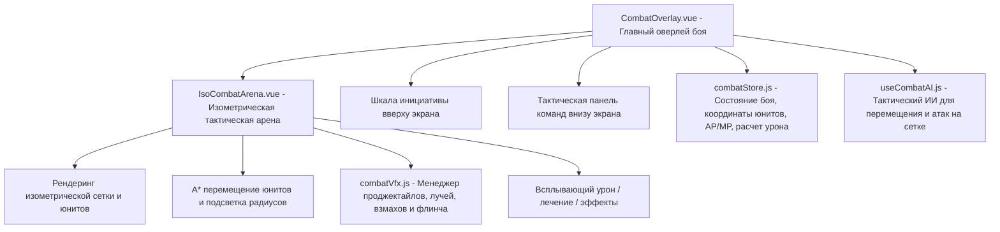
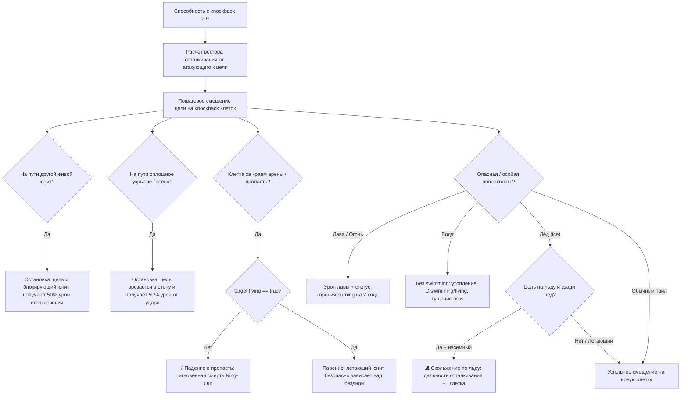

# Пошаговая боевая система (Turn-Based Combat System)

Пошаговая тактическая боевая система разработана в полноценном **изометрическом 2.5D формате** в стиле **Sword of Convallaria (SoC)** и **Final Fantasy Tactics**. Бой происходит на настоящей изометрической арене с перепадом высот, террасами, лестницами и укрытиями.

---

## 1. Архитектура и ключевые принципы



1. **Изометрическая 2.5D арена на сетке**:
   - Бой разворачивается на изометрической карте (по умолчанию `tests/arena_combat_test.json`, сетка 11×11 с каменными террасами, лестницами, высотами $Z$ и укрытиями).
   - Все 6 юнитов (3 союзника и 3 противника) имеют физические координаты на сетке `(x, y, z)` и ориентацию взгляда `facing` (`NW`, `NE`, `SW`, `SE`).
   - Поддерживается масштабирование колесом мыши (Zoom 0.7–2.2) и перемещение камеры зажатием средней/правой кнопки мыши.

2. **Очередность ходов на основе Инициативы (Initiative Turn Queue)**:
   - Каждый юнит обладает параметром `initiative` (скорость реакции).
   - В начале раунда все участники сортируются по убыванию инициативы. При равенстве союзники ходят раньше противников.
   - Вверху экрана отображается **шкала инициативы (Timeline)** в стиле Sword of Convallaria с карточками всех бойцов и мини-полосками HP. Текущий активный боец подсвечивается золотым ореолом и стрелочкой `▼`.

3. **Перемещение по сетке (Grid Movement, 1 AP Cost & 2-Click UX)**:
   - Каждый боец имеет радиус перемещения `moveRange` (Воин/Боец — 3 клетки, Лучник — 3 клетки, Маг — 2 клетки).
   - **Расход AP на перемещение**: каждый шаг (до `moveRange` клеток) расходует **1 AP**.
   - **Мульти-перемещение (Hit & Run)**: перемещение не ограничено одним разом за ход — юнит может двигаться повторно, пока у него есть свободные AP (`actor.ap >= 1`). Например, юнит с 3 AP может подбежать (1 AP), атаковать (1 AP) и отбежать в укрытие (1 AP).
   - В начале хода союзника режим движения активируется автоматически, если у него есть свободные AP.
   - **Двухкликовое перемещение (2-click movement)**:
     - **Первый клик** по доступной клетке: алгоритм A* `findPath` рассчитывает путь с обходом препятствий и других бойцов, отображает пунктирную неоновую траекторию, промежуточные маркеры шагов и подсвеченное кольцо цели.
     - **Повторный клик** по той же клетке: боец начинает пошаговое перемещение с плавной сменой ориентации (`facing`) на каждом шаге и фиксацией новой позиции.
     - **Клик по другой доступной клетке** перестраивает предварительный маршрут на новую цель; правый клик мыши или выбор способности отменяет предварительный путь.
   - Если после перемещения у юнита исчерпаны все AP (`actor.ap <= 0`), ход автоматически завершается.

4. **Геометрия атак, шаблоны направлений (`pattern`) и типы оружия (`weapon`)**:
   - Дальность и направления ударов определяются комбинацией типа экипированного оружия и геометрического шаблона способности:
     - **Меч (`sword`) / Паттерн `adjacent`**: бьёт на 1 клетку во все 8 сторон вокруг бойца (ортогональные и диагональные клетки, расстояние Чебышёва $\le 1$).
     - **Копьё (`spear`) / Паттерн `straight`**: бьёт на 1–2 клетки строго по прямым (ортогональным) линиям сетки (`dx === 0 || dy === 0`). По диагоналям бить не может.
     - **Лук (`bow`) / Паттерн `free`**: дальняя навесная стрельба на 2–4 клетки в любую сторону.
     - **Посох (`staff`)**: магическая атака на 1–2 или 1–3 клетки.
     - **Двуручный меч (`greatsword`) / Паттерн `cleave`**: размашистый взмах, поражающий основную цель и две соседние клетки дуги перед бойцом.
     - **Взрыв по площади (`aoe_point` / `aoeRadius > 0`)**: выбор целевой клетки или врага с поражением всех юнитов в радиусе взрыва (например, «Огненный шар» или «Огненный столп» с `aoeRadius: 1`).
     - **Пронзание по линии (`line_pierce`)**: пробивает всех врагов на прямой линии до `maxRange`.
   - **Отображение и предварительный просмотр на арене**:
     - При выборе способности на поле подсвечиваются все доступные клетки в соответствии с её шаблоном (крест для копья, 8 клеток для меча, дальнобойный контур для лука).
     - При наведении курсора на цель или клетку способности с уроном по площади (AoE или Cleave) зона взрыва/взмаха подсвечивается ярким янтарно-оранжевым пульсирующим контуром.
     - Поддерживается клик как по юниту, так и по пустой клетке поля боя для заклинаний с площадным эффектом.
   - **Строгая предварительная валидация дистанции**: проверка досягаемости цели (`store.isTargetInRange`) и наличия AP/MP выполняется **строго до** запуска анимаций и спецэффектов (VFX). Клик по цели вне зоны действия не расходует AP, не проигрывает анимации атаки и выводит всплывающую подсказку `«Вне радиуса!»` над целью.
   - При успешном ударе атакующий автоматически поворачивается к цели, проигрывается соответствующий VFX, наносится урон всем задетым целям, и над каждым пораженным юнитом всплывает анимированный текст урона.

5. **Очки действий (AP) и Мана (MP)**:
   - **AP (Action Points)**: очки скорости и времени в текущем раунде. Восстанавливаются до `maxAp` каждый ход. Тратятся как на перемещение (1 AP), так и на применение навыков:
     - **Быстрые приемы (1 AP)**: базовая атака, уворот, защитная стойка, базовый выстрел из лука, магический болт.
     - **Тяжелые способности и высшая магия (2 AP)**: мощные удары («Мощный удар», «Удар щитом»), прицельные выстрелы («Прицельный выстрел») и разрушительные заклинания («Драконья молния», «Огненный столп»). Требуют концентрации и отказа от движения перед применением (при базовом запасе в 2 AP).
   - **MP (Mana Points)**: общий запас магии на весь бой (восстанавливается медленно, по +1 MP за раунд). Заклинания тратят одновременно и AP, и MP (например, 2 AP + 4 MP).

6. **Формула расчёта урона**:
   $$\text{damage} = \max(1, \lfloor \text{attack} \times \text{power} \rfloor - \text{effectiveDefense})$$
   Где $\text{effectiveDefense} = \text{defense} \times 1.5$ при активном статусе `defended` и $\times 1.3$ при `evading`.

7. **Адаптивный интерфейс строго в `em`**:
   В соответствии с правилами `AGENTS.md`, оверлеи `CombatOverlay.vue` и `IsoCombatArena.vue` используют исключительно единицы `em` и `position: absolute; inset: 0` внутри `.game-area`.

---

## 2. Конфигурация боя в Encounter JSON

Файлы столкновений хранятся в `public/data/combat/encounters/<encounter_id>.json`.

Пример структуры:
```json
{
  "id": "carne_bandits",
  "name": "Нападение бандитов",
  "mapId": "tests/arena_combat_test",
  "description": "На дороге к деревне появились бандиты.",
  "winStory": "carne_bandits_win",
  "loseStory": "carne_bandits_lose",
  "allies": [
    {
      "id": "mc",
      "name": "Анон",
      "team": "ally",
      "class": "fighter",
      "hp": 40,
      "maxHp": 40,
      "mp": 0,
      "maxMp": 0,
      "ap": 2,
      "maxAp": 2,
      "attack": 8,
      "defense": 4,
      "initiative": 7,
      "x": -1,
      "y": 3,
      "z": 0,
      "facing": "NW",
      "moveRange": 3,
      "icon": "⚔️",
      "abilities": [
        {
          "id": "attack",
          "name": "Атака",
          "apCost": 1,
          "mpCost": 0,
          "minRange": 1,
          "maxRange": 1,
          "type": "damage",
          "power": 1.0,
          "targetType": "enemy",
          "icon": "⚔️"
        }
      ]
    }
  ],
  "enemies": [ ... ]
}
```

---

## 3. Боевой ИИ противников (`useCombatAI.js`)

AI противников действует с пространственным расчетом на сетке:
1. **Позиционирование**:
   - Если цель вне радиуса действия способностей — ИИ находит оптимальную клетку в пределах `moveRange` (`findBestMoveTile`) и перемещается к ней.
   - **Лучник**: старается держать дистанцию 2–4 клетки. Если враг подошел в упор — отступает на шаг назад.
   - **Воин**: сближается с ближайшим или слабейшим союзником вплотную.
   - **Маг**: если у союзника-противника дефицит HP $\ge 15$ — сближается для исцеления; иначе выходит на дистанцию 1–3 клеток для заклинания.
2. **Применение способностей**:
   - Применяет только те способности, цели которых находятся строго в пределах `[minRange, maxRange]`.
   - При нехватке AP или отсутствии целей ход автоматически передается дальше.

---

## 4. Визуальные эффекты (VFX) и поклеточная анимация (`combatVfx.js`)

Система визуальных эффектов и покадровой интерполяции оживляет изометрические бои:

1. **Плавное поклеточное перемещение (Sub-Tile Smooth Movement)**:
   - В `IsoCombatArena.vue` при перемещении союзников и противников координаты интерполируются покадрово (`currentX = from.x + (to.x - from.x) * progress`).
   - На каждом шаге пересчитывается направление взгляда (`facing`: `NW`, `NE`, `SW`, `SE`).
   - Юниты анимируются с лёгким пружинящим шагом (walk bob) по вертикали: $y_{\text{bob}} = -\sin(\text{progress} \times \pi) \times 4$.
   - Глубина отрисовки (`depth-sort key`) рассчитывается на основе текущих дробных координат юнита в реальном времени, обеспечивая корректный изометрический z-order при прохождении мимо препятствий и других бойцов.

2. **Модуль спецэффектов `combatVfx.js`**:
   - **Стрелы (Ballistic Projectiles)**: проджектайлы лучников летят по параболической траектории с настраиваемой высотой дуги, динамическим углом поворота наконечника и искрами при попадании в цель.
   - **Магические сферы (Magic Bolts)**: светящиеся сферы с градиентным ядром и частицами шлейфа (orange для пламени, purple для арканы).
   - **Небесный луч исцеления (Heal Beam)**: ниспадающий вертикальный градиентный луч света с поднимающимися изумрудными/золотыми искрами и символами `+`.
   - **Взмах клинка ближнего боя (Melee Slash)**: серповидный световой росчерк с радиальным углом атаки и разлетающимися искрами.
   - **Реакция на попадание (Hit Flinch & Flash)**: при получении урона цель кратковременно покачивается по горизонтали с затухающей синусоидой и подсвечивается красной вспышкой урона.

3. **Расширяемость (Extensibility)**:
   - Модуль построен на базе `createVfxManager()`, обновляется через `vfx.update(deltaMs, speedMultiplier)` и рисуется на Canvas через `vfx.render(ctx)`. Добавление новых эффектов осуществляется добавлением фабрик в `combatVfx.js`.

---

## 5. Спрайты персонажей и тактические токены (`isoSprites.js`)

1. **Персональные изометрические спрайты**:
   - Система проверяет наличие изометрических спрайтов персонажа в папках:
     - `images/sprites/characters/<name>/isometric/char.png`
     - `images/sprites/characters/<name>/icometric/char.png`
   - Поддерживаются синонимы и псевдонимы персонажей (`CHARACTER_ALIASES`), например `ainz` $\to$ `momonga`.
2. **Тактические токены при отсутствии спрайтов**:
   - В боевой арене для юнитов, не имеющих собственных изометрических спрайтов (например, бандитов или союзников, для которых спрайты еще не отрисованы), отключен автоматический фоллбек на модель главного героя.
   - Вместо дублирования чужого спрайта на поле выводится стилизованный тактический токен с классовой иконкой (`🛡️`, `🏹`, `🧙`, `🗡️`), цветом команды (синий/красный) и полоской здоровья.
3. **Фиксация направления взгляда (Direction Freeze)**:
   - В текущей версии отключено зеркальное отражение спрайтов (`scale(-1, 1)`) при смене направления взгляда на сетке.
   - Все изометрические спрайты всегда смотрят вперед в своей естественной проекции (до добавления спрайтов со спины).

---

## 6. Настройки боя (Скорость и анимации)

Параметры боя вынесены в настройки игры (`src/renderer/stores/settings.js` и `SettingsGeneral.vue`):

1. **Анимации в бою (`combatAnimations`)**:
   - `true` (по умолчанию): включены плавные перемещения по клеткам, полет стрел/магии, лучи лечения и реакции на попадания.
   - `false`: мгновенное перемещение и нанесение урона без задержек.
2. **Скорость боя (`combatSpeed`)**:
   - `1.0x`: обычная скорость анимаций и пауз ИИ.
   - `1.5x`: ускоренный темп боя.
   - `2.0x`: турбо-режим.
3. **Автосохранение**:
   - При переключении тумблеров настройки моментально сохраняются в пользовательский профиль через IPC `saveSettings`.

---

## 7. Интеграция со сценами и тестирование

1. **Сюжетная интеграция**:
   - В `scenes.json` сцена с полем `"combat": "carne_bandits"` автоматически открывает тактический бой.
   - При завершении боя по событию `@combat-end` новелла совершает сюжетный переход на `carne_bandits_win` или `carne_bandits_lose`.
2. **Стенд тестирования**:
   - В Главном меню в разделе «Тесты» доступен стенд «Пошаговый тактический бой» (`/test/combat`), позволяющий сразу запускать и тестировать сражения.

---

## 8. Направление взгляда персонажей и тактические стрелочки (Unit Facing & Back Direction)

Поскольку спрайты персонажей временно всегда смотрят в одну сторону (до готовности спрайтов со спины), под каждым персонажем на изометрическом холсте рисуется **тактический кольцевой маркер со стрелочкой направления**:

1. **Визуальные элементы под ногами юнита (`drawIsometricFacingIndicator`)**:
   - **Стрелочка взгляда (Directional Chevron Arrow)**:
     - Острый шеврон, указывающий строго в сторону взгляда персонажа (`SE`, `SW`, `NW`, `NE`).
     - Рассчитывается в ортогональном 2.5D пространстве с сжатием $Y$ 2:1 (`(u, v) \to (x = u, y = v \times 0.5)`), благодаря чему стрелка идеально ложится на изометрическую плоскость пола.
     - Цвета фракций:
       - 🟡 **Активный персонаж**: золотой шеврон (`#f6c445`) с золотым свечением `shadowBlur`.
       - 🔵 **Союзники**: небесно-голубой шеврон (`#38bdf8`) с темной обводкой (`#0369a1`).
       - 🔴 **Враги**: кораллово-красный шеврон (`#f87171`) с темно-бордовой обводкой (`#991b1b`).
   - **Кольцевая база фракции (Tactical Ground Ring)**:
     - Изометрический эллипс вокруг стоп персонажа с радиусом 19×9.5 px.
   - **Засечка спины (Rear Notch)**:
     - Плоская поперечная засечка на противоположной от взгляда стороне кольца, безошибочно обозначающая, где у персонажа находится спина (тыл).
2. **Динамический поворот**:
   - При перемещении по клеткам юнит автоматически поворачивает стрелочку в сторону текущего шага (`updateFacing`).
   - При выборе цели для атаки или способности юнит разворачивается лицом к цели (`targetPoint`).
3. **Геометрия атак с тыла (`isoFacing.js`)**:
   - `getFacingVector(facing)`: возвращает нормализованный вектор `(du, dv)`.
   - `getOppositeFacing(facing)`: возвращает противоположное направление (`SE` $\leftrightarrow$ `NW`, `SW` $\leftrightarrow$ `NE`).
   - `getRelativeAttackAngle(attackerPos, targetPos, targetFacing)`: скалярное произведение вектора атаки с вектором взгляда цели возвращает `'front'` (сектор $\pm 60^\circ$), `'side'` (фланги) или `'back'` (сектор тыла $\pm 60^\circ$).
   - `isBackAttack(attackerPos, targetPos, targetFacing)`: булев флаг удара в спину.

---

## 9. Физика отталкивания, столкновения и опасные поверхности (Knockback, Collisions & Hazards)

В тактическую изометрическую боевую систему внедрена пространственная физика в стиле **Sword of Convallaria**:



1. **Отталкивание (`knockback: N`)**:
   - Если у способности указан `knockback: N` (например, `shield_bash` Альбедо имеет `knockback: 1`), модуль `resolveKnockback` вычисляет вектор смещения от атакующего к цели $(\Delta x, \Delta y)$ и толкает цель на $N$ клеток назад.
   - Направление смещения строго согласовано с сеткой: при ударе сбоку — по горизонтали, при ударе спереди/сзади — по вертикали, при диагональном ударе — по диагонали.

2. **Столкновения (Collisions & Collateral Damage)**:
   - **Столкновение со вторым юнитом («Эффект домино»)**: если позади цели находится другой живой боец, отталкиваемый юнит останавливается перед ним. Оба бойца получают сокрушительный урон от столкновения (50% от силы удара, $\ge 2$ HP).
   - **Столкновение со стеной или сплошным укрытием**: если позади цели расположено препятствие с флагом `solid: true` (каменное укрытие, ящики, бочки) либо граничная стена тайла (`edge wall`), цель врезается в него и получает 50% урона от удара о стену.
   - **Перепады высот ($\Delta z$), скалы и падение с уступов (Cliffs & Fall Damage)**:
     - **Подъём на уступ ($\Delta z = +1$)**: блок на 1 высоту выше считается ступенькой/лестницей: цель успешно заталкивается на него и поднимается на террасу (`z += 1`).
     - **Столкновение с отвесной скалой ($\Delta z \ge +2$)**: блок с перепадом высоты $\ge 2$ вверх для нелетающих юнитов считается отвесной скалой/стеной: цель не может на него заскочить, останавливается перед уступом и получает урон от столкновения о скалу (50% силы удара).
     - **Падение с уступа вниз ($\Delta z_{\text{drop}} \ge 2$)**: если цель сталкивают с уступа высотой 2 уровня и выше вниз ($\text{currentZ} - \text{nextZ} \ge 2$), юнит приземляется на нижний ярус и получает дополнительный урон от падения:
       $$\text{fallDamage} = \max(4 \times \Delta z_{\text{drop}}, \lfloor \text{strikeDamage} \times 0.5 \times \Delta z_{\text{drop}} \rfloor)$$
       Например, падение с уступа высотой 2 при ударе силой 10 наносит $10$ урона от падения. При этом спавнятся искры приземления (`spawnImpactSparks`), всплывает текст `🤸 -N` и срабатывает сотрясение (`triggerFlinch`).
     - **Спуск на 1 уровень ($\Delta z_{\text{drop}} = 1$)**: считается мягким спуском по ступени и урона от падения не наносит.
     - **Летающие юниты (`flying: true`)**: свободно преодолевают уступы любой высоты вверх и плавно спускаются вниз, обладая полным иммунитетом к урону от падения и столкновениям со скалами.
   - В точке столкновения спавнятся искры удара (`spawnImpactSparks`), всплывают плашки урона и срабатывает сотрясение обоих бойцов (`triggerFlinch`).

3. **Пропасти и сброс с арены (Chasm / Void Fall / Ring-Out)**:
   - Если цель выталкивается за край изометрической платформы (на координату, где нет тайла пола в `mapTiles`, либо тайл с типом `empty`/`void`/`chasm`):
     - Для обычных наземных бойцов: цель срывается в бездну и **мгновенно погибает** (`Ring-Out`) вне зависимости от текущего запаса HP.
     - На изометрическом холсте проигрывается анимация падения: цель ускоренно смещается вниз по $Y$ (`fallY`) с затуханием прозрачности до 0 (`alpha`).

4. **Левитация и полёт (`flying: true`)**:
   - Летающие персонажи (например, Аинз с трейтом `"flying": true`):
     - **Иммунитет к пропастям**: при сбросе за край арены парят над пустотой, не падая и не погибая.
     - **Иммунитет к напольным ловушкам и лаве**: не получают урон от раскаленной лавы и не загораются при нахождении над ней.
     - **Иммунитет к скольжению по льду**: парят над поверхностью и не скользят.

5. **Опасные и особые поверхности (Hazards & Surfaces: Lava, Water, Ice)**:
   - **Раскалённая лава (`lava` / `fire`)**:
     - При отталкивании в лаву наземный юнит сразу получает урон лавы (-6 HP) и накладывается статус горения `burning` на 2 раунда.
     - В начале каждого своего хода юнит, стоящий в лаве, получает периодический урон лавы (-6 HP).
     - Юниты с трейтом `fireImmune: true` или `flying: true` игнорируют эффекты лавы.
     - На изометрической арене тайлы лавы процедурно рендерятся с пульсирующим красно-оранжевым свечением.
   - **Глубокая вода (`water`)**:
     - Боец без свойств `flying` или `swimming` при падении в глубокую воду тонет (`drowning`).
     - Плавающий боец (`swimming: true`) в воде тушит статус горения `burning`.
     - На арене тайлы воды отображаются полупрозрачной лазурью с легким динамическим волновым бликом.
   - **Ледяная поверхность (`ice`) и скольжение**:
     - Если наземный боец стоит на льду и вектор отталкивания направлен на следующий тайл льда («цель стоит на льду и за ней ещё лёд»), сила трения исчезает — цель поскальзывается и **скользит на 1 дополнительную клетку** (например, «Удар щитом» отталкивает цель не на 1, а на 2 клетки!).
     - Если на втором шаге скольжения находится препятствие, стена или другой юнит, срабатывает полноценная физика столкновений. Если обрыв — цель срывается в бездну.
     - Летающие персонажи (`flying: true`) не касаются льда и не скользят.
   - **Визуальная идентификация поверхностей на арене**:
     - На каждом опасном/особом тайле по центру отображается атмосферная пульсирующая эмблема: `🔥` для лавы, `🌊` для воды, `🧊` для льда.
     - При наведении курсора на любой тайл арены активируется золотистая тактическая подсветка контура клетки, а в левом нижнем углу экрана появляется карточка инспектора тайла (`hover-tile-card`) с описанием механик, координат `[X, Y]`, высоты $Z$ и расположенных укрытий.
     - При наведении на персонажа в его карточке характеристик отображается строка `Поверхность`, информирующая о грунте под ногами (например, `🧊 Лёд (Скольжение)` или `🔥 Лава (Горение)`).
     - Поверхности `ice`, `lava`, `water` интегрированы в палитру тайлов редактора карт (`IsoEditorView.vue`) и обработчик изометрических сцен новеллы (`IsoCanvas.vue`).

6. **Статус горения (`burning`)**:
   - Накладывается на 2 раунда.
   - На каждом ходу пораженного юнита в `tickStatuses` наносит 4 единицы огненного урона, выводит лог `🔥 <Имя> горит! (-4 HP)` и всплывающий текст `🔥 -4`.
   - Над головой горящего юнита на арене горит бейдж `🔥`, а на тактической панели — чип `🔥 Горение`.
