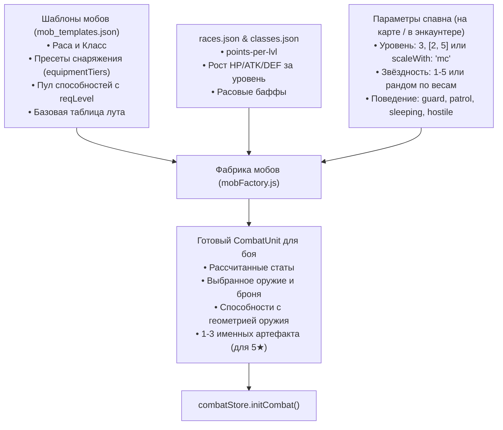

# Система безымянных мобов, звёздности и энкаунтеров (Mob System)

Данный документ описывает систему процедурной генерации и настройки безымянных противников (мобов), их рангов звёздности (1★–5★), пресетов снаряжения по тирам уровней, динамического скалирования и интеграции с изометрическими локациями.

---

## 1. Архитектура и ключевые принципы



1. **Характеристики строго из Расы и Классов (Без ручного дублирования)**:
   - В шаблонах мобов не прописываются фиксированные числа `hp: 30, attack: 7`.
   - Характеристики рассчитываются динамически движком `calculateStatsFromRaceAndClass`:
     - Гуманоиды (`human`) направляют 100% уровней в классы (`job classes`).
     - Монстры и негуманоиды (`skeleton`, `beast`) делят уровни между расой и классом согласно `raceLevelRatio` (по канону Overlord).
     - Приросты за уровень берутся из параметров классов (`CLASS_STAT_PROFILES`) и расовых данных (`races.json -> points-per-lvl` и `baffes`).

2. **Ранги звёздности (1★ до 5★)**:
   - Мобам можно задавать жесткую звёздность или разыгрывать её случайно по весам (`DEFAULT_STAR_WEIGHTS`).
   - Градация рангов:
     - **1★ (Слабый / Хлипкий)**: 0.85x HP, 0.9x ATK, ухудшенный пул снаряжения (ветошь, ржавое оружие), 0 случайных навыков из пула.
     - **2★ (Обычный)**: 1.0x HP, 1.0x ATK, базовое снаряжение, 1 дополнительный навык.
     - **3★ (Сильный / Ветеран)**: 1.25x HP/ATK/DEF, улучшенное снаряжение (щиты, железо), 1–2 дополнительных навыка.
     - **4★ (Элитный)**: 1.6x HP/ATK/DEF, **+1 AP** (всего 3 AP за ход), элитное снаряжение, 2 навыка из пула.
     - **5★ (Легендарный / Чемпион)**: 2.2x HP/ATK/DEF, **+1 AP**, высшее снаряжение, 2–3 навыка. **Важно: 5★ — это не уникальный сюжетный босс-NPC**, а редчайший супер-монстр или чемпион пачки среди безымянных мобов.
   - **Генерация уникальных именных предметов для 5★**:
     - 1–3 предмета экипировки моба преобразуются в именные артефакты (например, *«Драконий боевой меч»*, *«Теневой доспех»*) с использованием префиксов `RARITY_PREFIXES` и повышенным качеством (`rollQuality('legendary')`).
     - Количество артефактов определяется по регрессивной шкале вероятности:
       - 1-й предмет: **100%**
       - 2-й предмет: **30%**
       - 3-й предмет: **10%**
     - Эти уникальные предметы гарантированно падают игроку в качестве трофея после победы.

3. **Пресеты снаряжения по тирам уровней (`equipmentTiers`)**:
   - В шаблоне моба настраиваются диапазоны уровней (например, 1–3, 4–8, 9+).
   - Внутри каждого тира описаны варианты экипировки для каждой звёздности (`weak`, `normal`, `strong`, `elite`, `legendary`).
   - Выбранное оружие определяет шаблон атаки в бою (`sword` $\to$ `adjacent`, `spear` $\to$ `straight`, `bow` $\to$ `free`).

4. **Динамическое скалирование уровней (Auto-Scaling)**:
   - **Фиксированный уровень**: `level: 4` или диапазон `level: [3, 5]`.
   - **Скалирование по ГГ**: `scaleWith: "mc"`, `levelOffset: [-1, 1]`.
   - **Скалирование по группе**: `scaleWith: "party_avg"`.
   - **Ограничители**: `minLevel` и `maxLevel` предотвращают перекач или обесценивание локаций.

5. **Поведение мобов на изометрических картах**:
   - `passive`: нейтральный моб, не атакует сам.
   - `guard`: охраняет точку, агрится при входе в радиус (2 клетки).
   - `patrol`: патрулирует маршрут, агрится в радиусе (3 клетки).
   - `hostile`: агрессивен, агрится при приближении игрока на 3 клетки (загорается значок `❗️`).
   - `sleeping`: спит в лагере (над головой `💤`). Не агрится на дистанции; просыпается только при наступлении игрока вплотную (расстояние $\le 1$) или при прямом клике.
   - `fleeing`: убегает от игрока (лут-моб).

---

## 2. Конфигурация шаблонов мобов (`mob_templates.json`)

Файл: `src/renderer/public/data/combat/mob_templates.json`

```json
{
  "skeleton_warrior": {
    "id": "skeleton_warrior",
    "name": "Скелет-воин",
    "icon": "💀",
    "sprite": "images/sprites/characters/skeleton/default.png",
    "race": "skeleton",
    "class": "warrior",
    "raceLevelRatio": 0.3,
    "tags": ["undead", "monster", "melee"],
    "moveRange": 3,
    "equipmentTiers": [
      {
        "minLevel": 1,
        "maxLevel": 3,
        "variants": {
          "weak": { "weapon": "rusty_sword", "armor": "tattered_rags" },
          "normal": { "weapon": "iron_sword", "armor": "tattered_rags" },
          "strong": { "weapon": "iron_sword", "shield": "wooden_buckler", "armor": "leather_armor" },
          "elite": { "weapon": "iron_spear", "shield": "iron_shield", "armor": "chainmail_scrap" },
          "legendary": { "weapon": "adamantite_sword", "shield": "iron_shield", "armor": "chainmail_scrap" }
        }
      }
    ],
    "abilities": {
      "guaranteed": [
        { "id": "attack", "name": "Атака оружием", "useWeapon": true, "apCost": 1, "power": 1.0, "type": "damage", "icon": "⚔️" }
      ],
      "pool": [
        { "id": "power_attack", "name": "Мощный удар", "reqLevel": 1, "weight": 3, "useWeapon": true, "apCost": 2, "power": 1.5, "icon": "💥" },
        { "id": "shield_bash", "name": "Удар щитом", "reqLevel": 2, "weight": 2, "apCost": 2, "power": 1.1, "knockback": 1, "pattern": "straight", "icon": "🛡️" }
      ]
    },
    "lootTable": [
      { "itemId": "bone_fragment", "chance": 0.85, "count": [1, 3] }
    ]
  }
}
```

---

## 3. Отряды мобов (Mob Packs / `mob_packs.json`)

Файл: `src/renderer/public/data/combat/mob_packs.json`

Позволяет на изометрической карте отображать одну фигурку патруля, которая в тактическом бою разворачивается в полноценную боевую группу:

```json
{
  "skeleton_patrol": {
    "id": "skeleton_patrol",
    "name": "Патруль нежити",
    "mapId": "tests/arena_combat_test",
    "enemies": [
      { "template": "skeleton_warrior", "role": "tank", "star": [2, 3], "level": [2, 4], "x": 0, "y": -3, "z": 0 },
      { "template": "skeleton_warrior", "role": "melee", "star": [1, 2], "level": [1, 3], "x": 1, "y": -3, "z": 0 },
      { "template": "skeleton_archer", "role": "ranged", "star": [1, 3], "level": [1, 3], "x": -2, "y": -3, "z": 0 }
    ]
  }
}
```

---

## 4. Размещение мобов на изометрических картах

В массиве `objects` файла изометрической локации:

```json
{
  "id": "cemetery_patrol_1",
  "type": "mob",
  "name": "Патруль скелетов",
  "icon": "💀",
  "pos": [3, 1, 0],
  "facing": "SW",
  "solid": true,
  "interactive": true,
  "behavior": "hostile",
  "aggroRadius": 3,
  "pack": "skeleton_patrol",
  "activePhases": ["evening", "night"]
}
```

Или для лагеря спящих бандитов:
```json
{
  "id": "bandit_sleeper_1",
  "type": "mob",
  "name": "Спящий разбойник",
  "icon": "🗡️",
  "pos": [-2, -2, 0],
  "solid": true,
  "interactive": true,
  "behavior": "sleeping",
  "template": "bandit_melee",
  "level": [2, 4],
  "star": 2
}
```

---

## 5. Программный интерфейс (`mobFactory.js`)

* `calculateStatsFromRaceAndClass({ raceId, classId, level, raceRatio })` — расчет характеристик на основе рас и классов.
* `resolveMobLevel(levelConfig, context)` — вычисление уровня с поддержкой динамического скалирования по ГГ или группе.
* `resolveEquipmentForMob(template, level, starMeta)` — подбор экипировки по тирам и генерация именных артефактов для 5★ мобов.
* `createMobInstance(templateOrId, spawnConfig, context)` — генерация единичного `CombatUnit` для боя.
* `resolveEncounterFromSquad(squadConfig, context)` — генерация полного энкаунтера боя, совместимого с `combatStore.initCombat()`.
