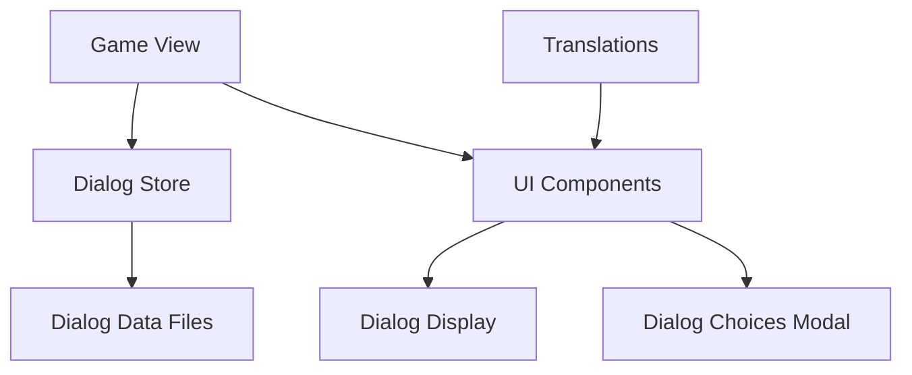

# Dialog System Architecture

## Overview
The dialog system is designed to handle complex, non-linear, multilingual dialog trees in the game.

## Components



## Data Flow

1. **Game View** triggers a dialog by calling `dialogStore.startDialog(dialogId)`
2. **Dialog Store** loads the dialog data 
3. **Dialog Store** manages the current dialog state and node navigation
4. **Game View** displays the current dialog node text at the bottom of the screen
5. **Game View** shows dialog choices as a modal in the center of the screen when needed
6. **Translations** provide localized text for all dialog elements
7. **Variable Replacement** processes placeholders in dialog texts using game store data

## File Structure

```
src/
├── renderer/
│   ├── public/
│   │   └── dialogs/            # Dialog data files (NEW LOCATION)
│   │       ├── en/             # English dialogs
│   │       │   ├── intro_scene.json
│   │       │   ├── second_scene.json
│   │       │   └── third_scene.json
│   │       ├── ru/             # Russian dialogs
│   │       │   ├── intro_scene.json
│   │       │   ├── second_scene.json
│   │       │   └── third_scene.json
│   │       └── README.md
│   ├── stores/
│   │   └── dialog.js           # Dialog state management
│   └── utils/
│       └── dialogLoader.js     # Dialog data loading utility
│   └── views/
│       └── game/
│           └── Game.vue        # Game view with integrated dialog UI
```

## UI Layout

1. **Dialog Triggers**: Buttons to start dialogs are positioned at the top center of the screen
2. **Dialog Display**: Current dialog text and speaker are shown at the bottom center
3. **Dialog Choices**: Appear as a modal overlay in the center of the screen

## Dialog Data Format

Each dialog is stored as a JSON file with this structure:

```json
{
  "id": "dialog_id",
  "title": "Dialog Title",
  "nodes": {
    "node_id": {
      "id": "node_id",
      "speaker": "character_id",
      "text": "Dialog text with {mc.name} variables",
      "choices": [
        {
          "id": "choice_id",
          "text": "Choice text with {world.cur_time} variables",
          "nextNode": "next_node_id"
        }
      ]
    }
  },
  "startNode": "initial_node_id"
}
```

## Features

1. **Multilingual Support**: All text is stored with language keys
2. **Non-linear Dialog Trees**: Choices can lead to any node in the dialog
3. **Dialog History**: Players can backtrack through conversation history
4. **Extensible Design**: Easy to add new dialog scenes by creating new JSON files
5. **Dynamic Loading**: Dialog data is loaded on demand
6. **Separation of Display**: Dialog text at bottom, choices in center modal
7. **Flexible Variable Replacement**: Use `{path.to.variable}` syntax to reference any game store property
8. **Language Separation**: Each language has its own directory for easier translation

## Variable Replacement System

The dialog system now supports flexible variable replacement using either:
1. `{path.to.variable}` syntax (simplified, recommended)
2. `{g.path.to.variable}` syntax (with 'g.' prefix, for backward compatibility)

This allows referencing any property from the game store directly in dialog texts.

### How it works:
1. Placeholders in the format `{path.to.variable}` or `{g.path.to.variable}` are automatically detected in dialog texts
2. The system navigates through the game store object using the provided path
3. If the path exists, the placeholder is replaced with the corresponding value
4. If the path doesn't exist, the placeholder is left unchanged

### Example:
```json
{
  "text": "Hello, {mc.name}! The current time is {world.cur_time}."
}
```

This replaces `{mc.name}` with the player's name and `{world.cur_time}` with the current time value from the game store.

Both syntaxes work interchangeably:
- `{mc.name}` (simplified)
- `{g.mc.name}` (with 'g.' prefix, for backward compatibility)

## Language Organization

Dialogs are now organized by language in the `public/dialogs` directory:
- Each language has its own subdirectory (`en`, `ru`, etc.)
- Files contain only the content for that specific language
- The dialog loader automatically selects the appropriate language based on the user's locale
- This makes it easier for different translators to work on different languages independently